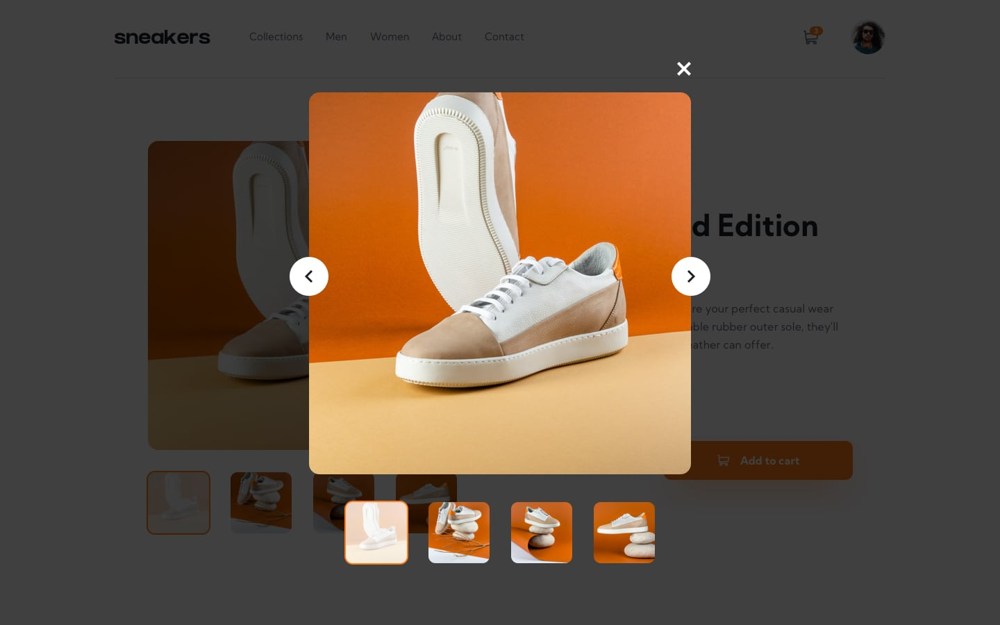
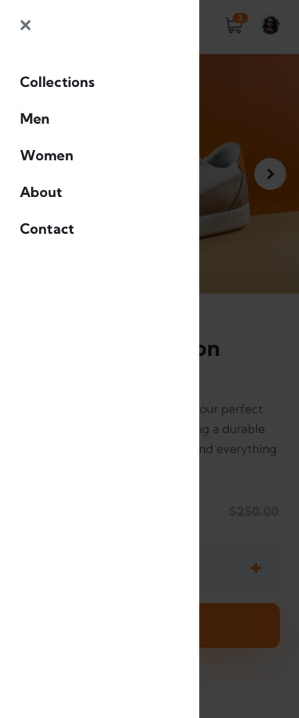
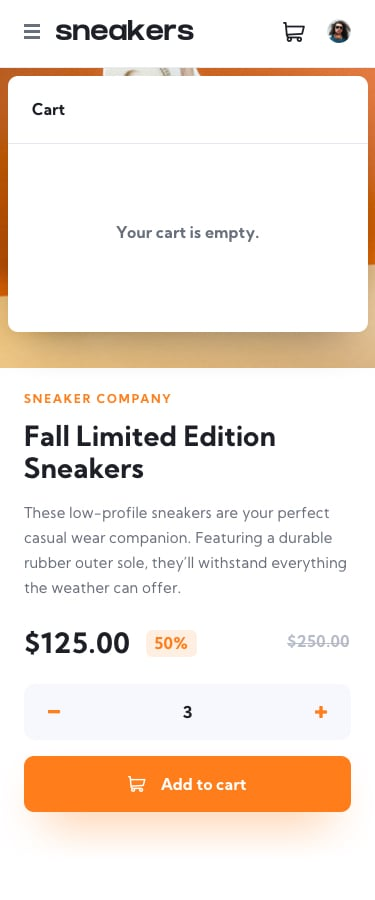

# Frontend Mentor - E-commerce product page

## Welcome! 👋

### Design

- #### Desktop Design

  | Home                                        | Lightbox                                          | Cart Filled                                              | Cart Empty                                             |
  | ------------------------------------------- | ------------------------------------------------- | -------------------------------------------------------- | ------------------------------------------------------ |
  |  |  |  |  |

- #### Mobile Design
  | Home                                       | Menu                              | Cart Filled                                              | Cart Empty                                             |
  | ------------------------------------------ | --------------------------------- | -------------------------------------------------------- | ------------------------------------------------------ |
  |  |  |  |  |

### Planning

1# - BUSINESS REQUIREMENTS

- very simple app, where users can order 1 or more shoes from the app
- requires no user accounts and no login: since its just a showcase challenge
- Users can add multiple shoes to a cart before ordering
- Users can see the cart and delete items from the cart
- Users can see and navigate photos of the shoe with a lightbox

#2 - Features and Pages

- Feature Categories

  1. Product
  2. Cart
  3. Gallery

- Necessary Pages
  1. Homepage (in the design it is a 1 pager app)

#3 - State Management

- Feature Categories

  1. Product
  2. Cart
  3. Gallery

- Types of state

  1. Product -> Global UI state
  2. Cart -> Global UI State
  3. Gallery -> Global UI State

- Technology Decisions
  - Routing - react-router-dom - so i can use useSearchParams hook
  - Styling - Styled Components - wanted to showcase my skill on this tech tool.
  - UI State management
    - Redux Toolkit (RTK) - Wanna show case my RTK skills
    - URL Params - using react-router-dom's useSearchParams i can share the app's current state to another user.

---

## Extra Features

- #### Added Stripe payment
  - can use test card 4242 4242 4242
- #### Cart is Saved on Local Storage
  - refreshing the page wont let dissapear
- #### Share gallery state to other people
  - users can share the homepage with the current position of selected image.

## Built with

- ### React
- ### React Router Dom
- ### Styled Components
- ### Vite
- ### Redux Toolkit
- ### Mobile-first workflow
- ### Stripe
- ### NodeJS
- ### Express

---

## Links

- ### Live Site URL : [here](https://e-commerce-product-page-yvby-frontend.vercel.app/)
- ### Backend URL for Notes : [here](https://e-commerce-product-page-flame.vercel.app/)
- ### Frontend Mentor(FEM) Solution URL : [here](https://www.frontendmentor.io/solutions/ecommerce-product-page-with-redux-toolkit-styled-components-stripe-X9LC61lcRZ)
